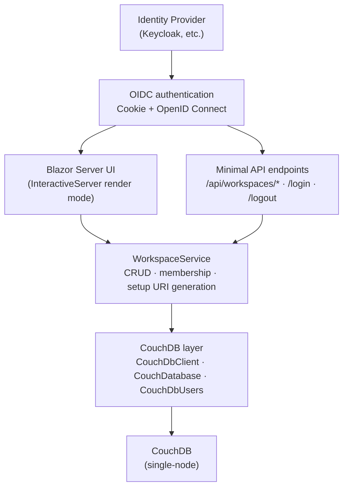

# Architecture

Obsidian Sync Manager is a Blazor Server app that manages [Obsidian LiveSync](https://github.com/vrtmrz/obsidian-livesync) workspaces backed by CouchDB, with authentication delegated to any OpenID Connect provider.



## Data Model

All persistent state lives in CouchDB. The app uses admin credentials (configured via environment variables) to manage databases and users. A CouchDB user is created for each OIDC user on first login with a deterministically derived password (see Security Model).

### workspace-registry

A single database that stores workspace metadata. Each document is a `WorkspaceRegistryDoc`:

| Field | Type | Description |
|-------|------|-------------|
| `_id` | string | 12-character GUID prefix (no hyphens) |
| `name` | string | Human-readable workspace name |
| `databaseName` | string | `livesync-{id}` |
| `createdBy` | string | OIDC `preferred_username` of the creator |
| `e2eePassphrase` | string | Base64-encoded 256-bit random key for end-to-end encryption |

The registry also stores the HMAC secret (`app:hmac-secret`) used to derive per-user CouchDB passwords, encrypted via ASP.NET Core Data Protection.

### livesync-{workspaceId}

One database per workspace, created on demand. The Obsidian LiveSync plugin replicates vault data into these databases. CouchDB `_security` ACLs restrict each database to the workspace's member list.

## Security Model

### Authentication & Authorization

The app uses ASP.NET Core cookie + OpenID Connect. After the Authorization Code exchange, a cookie session is created. The `sub`, `preferred_username`, and `groups` claims drive identity and authorization.

Two group-based policies enforce role requirements:

| Policy | Required OIDC Group |
|--------|---------------------|
| Admin | `obsidian-admins` (configurable) |
| User | `obsidian-users` or `obsidian-admins` (configurable) |

### CouchDB Credentials

Per-user CouchDB passwords are derived from the OIDC `sub` claim — no passwords are stored per-user:

```
HMAC-SHA256(secret_key, sub) → hex-encoded CouchDB password
```

The HMAC secret is generated once on first startup, encrypted with Data Protection, and stored in `workspace-registry`.

### Database Isolation

Each `livesync-*` database has a `_security` document that is the single source of truth for workspace membership. CouchDB enforces that only listed users can read or write the database. The web app reads and writes this document directly when checking or modifying members — membership is never duplicated elsewhere.

### Setup URI Encryption

Setup URIs contain CouchDB credentials and must be protected in transit. The encryption pipeline matches the format expected by the Obsidian LiveSync plugin (`octagonal-wheels` library):

1. **PBKDF2** — 310,000 iterations, random 32-byte salt, SHA-256 → master key
2. **HKDF-SHA256** — random 32-byte salt, empty info → AES-256-GCM key
3. **AES-256-GCM** — 12-byte IV, 128-bit auth tag → ciphertext
4. **Wire format** — `%$` + Base64(pbkdf2Salt | iv | hkdfSalt | ciphertext + tag)

The URI passphrase is a human-friendly `adjective-noun` pair the user types into Obsidian (not copied, to avoid clipboard exposure). A separate E2EE passphrase — 32 cryptographically random bytes, base64-encoded — is generated per workspace for vault data encryption.

## Key Flows

### Create Workspace

1. Generate a 12-character workspace ID (GUID prefix, no hyphens)
2. Create CouchDB database `livesync-{id}`
3. Set `_security` ACL with the creating user as sole member
4. Generate a base64-encoded 256-bit random E2EE passphrase
5. Write a `WorkspaceRegistryDoc` to `workspace-registry`

### Generate Setup URI

1. Derive the user's CouchDB password from their `sub` claim
2. Build a JSON settings object (CouchDB URL, credentials, database name, E2EE passphrase, LiveSync options)
3. Encrypt with a random `adjective-noun` URI passphrase using the PBKDF2 → HKDF → AES-256-GCM pipeline
4. Encode as `obsidian://setuplivesync?settings=...`
5. Generate a QR code (SVG, error correction level L)

### Add Member

1. Read the `_security` document to verify the requesting user is already a member
2. Verify the target user has logged in at least once (CouchDB account exists)
3. Add the target username to the `_security` ACL on the workspace database

## Design Decisions

**Derived passwords** — `HMAC-SHA256(secret, sub)` lets the app compute CouchDB passwords on every request without storing per-user credentials.

**Per-workspace databases** — Workspaces map to one CouchDB database each, so LiveSync replication works directly between the plugin and CouchDB without the web app in the data path.

**Word-based URI passphrase** — The URI passphrase uses a short `adjective-noun` format for manual typing (avoids clipboard exposure). The E2EE passphrase is 32 random bytes (base64) for maximum entropy.

**Single source of truth for membership** — Workspace members are stored exclusively in the CouchDB `_security` document, avoiding duplication between the registry and the database ACL.

**Generic OIDC** — Uses `AddOpenIdConnect()` with no provider-specific packages. Any OIDC provider supporting Authorization Code flow with a `groups` claim works.
